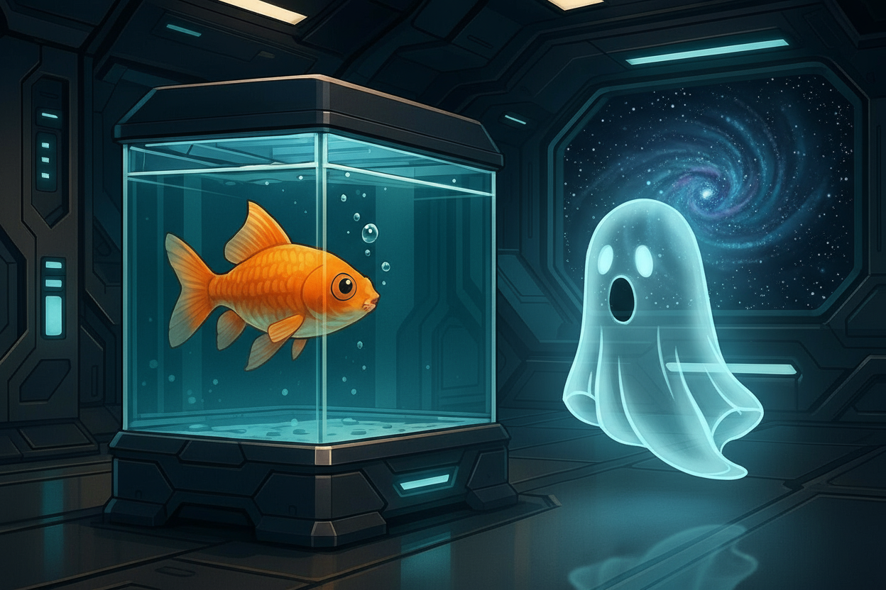

# Configuration



This repository contains terminal and editor configurations optimized for development, featuring Neovim (AstroNvim v5), Ghostty with automatic theme switching, consistent color schemes, Fish shell integration, and Clojure configuration.

## Installation

Follow these steps in order to set up your terminal environment. **Note**: Before starting, see [Backup Existing Configuration](#backup-existing-configuration) to preserve your current setup.

### Terminal

The foundation of your development environment.

#### 1. Ghostty Terminal

**Install Ghostty**:

```bash
# Fast, feature-rich, and cross-platform terminal emulator that uses platform-native UI and GPU acceleration
brew install --cask ghostty

# Create symlink to entire folder to keep in sync
ln -sf "$(pwd)/ghostty" ~/.config/ghostty
```

### CLI Tools

Shell enhancements for productivity and aesthetics. Install these before Fish shell so they're available in Fish functions and configs.

#### 2. Navigation & Search Tools

These tools work together to provide modern file navigation, fuzzy finding, and smart directory jumping.

**Install Eza**:

```bash
# A modern alternative to ls with icons and git integration
brew install eza

# Create symlink to config file to keep in sync
ln -sf "$(pwd)/eza" ~/.config/eza
```

**Install FZF**:

```bash
# A command-line fuzzy finder
brew install fzf

# Create symlink to entire folder to keep in sync
ln -sf "$(pwd)/fzf" ~/.config/fzf
```

**Install fd**:

```bash
# A simple, fast and user-friendly alternative to 'find'
brew install fd
```

**Install Zoxide**:

```bash
# A smarter cd command that learns your habits
brew install zoxide
```

#### 3. Bat

**Install Bat**:

```bash
# A cat clone with syntax highlighting and Git integration
brew install bat

# Create symlink to entire folder to keep in sync
ln -sf "$(pwd)/bat" ~/.config/bat

# Build bat cache to activate the theme
bat cache --build
```

#### 4. ripgrep

**Install ripgrep**:

```bash
# A line-oriented search tool that recursively searches directories for a regex pattern
brew install ripgrep
```

### Shell & Prompt

The shell and prompt that leverage the CLI tools installed above.

#### 5. Fish Shell

**Install Fish shell**:

```bash
# Fish is a smart and user-friendly command line shell.
brew install fish

# Create symlink to entire folder to keep in sync
ln -sf "$(pwd)/fish" ~/.config/fish
```

**Configuration includes**:
- Modular configuration using numbered `conf.d/` files for load ordering
- Environment variables (`$EDITOR`, `$VISUAL`) configured in `10-env.fish`
- Morning routine function for system updates
- Comprehensive abbreviations for productivity
- System utilities (DNS flush, IP address tools)
- Memory and CPU usage monitoring
- GPG and SSH agent setup
- Automatic theme switching (Catppuccin light/dark)
- Integration with Starship prompt and Zoxide

#### conf.d/

Configuration files are loaded in numbered order:
- `00-paths.fish` - PATH setup (uses `fish_add_path` for deduplication)
- `10-env.fish` - Environment variables
- `20-history.fish` - Shell history behavior
- `30-*.fish` - Tool configurations (eza, fzf, zoxide)
- `40-gpg.fish` - GPG/SSH agent setup
- `50-starship.fish` - Prompt configuration
- `60-sdk.fish` - SDKMAN integration
- `90-themes.fish` - Theme switching (loaded last)

#### Custom Functions & Features

**Navigation & Search:**
- `e` - Enhanced directory listing (eza with icons, git status, and hyperlinks)
- `f` - Fuzzy find files and directories
- `fe` - Fuzzy find and edit file in `$EDITOR`
- `ff` - Fuzzy find directory and open in Finder
- `fz` - Fuzzy find directory and jump with zoxide
- `fkill` - Fuzzy find and kill process

**Git Abbreviations:**
- `g` → `git`
- `gs` → `git status`
- `ga` → `git add`
- `gaa` → `git add .`
- `gc` → `git commit`
- `gca` → `git commit --amend`
- `gps` → `git push`
- `gpl` → `git pull`
- `gd` → `git diff`
- `gdh` → `git diff HEAD`
- `gco` → `git checkout`
- `gb` → `git branch`
- `grb` → `git rebase`
- `grs` → `git reset`
- `grt` → `git restore`
- `gst` → `git stash`
- `glog` → `git log --oneline --graph --decorate`

**Utilities:**
- `morning` - Update Homebrew
- `uuid` - Generate UUID and copy to clipboard
- `flushdns` - Flush DNS cache
- `running_services` - List running services
- `whatismyipaddress` - Get public IP address
- `localip` - Get local IP address
- `sha1` - Calculate SHA1 hash
- `md5sum` - Calculate MD5 hash
- `psmem` / `psmem10` - Sort processes by memory usage
- `pscpu` / `pscpu10` - Sort processes by CPU usage

**Theme System:**
The configuration features unified automatic theme switching based on macOS appearance:
- **FZF**: Catppuccin Mocha (dark) / Latte (light) with custom previews
- **EZA**: Catppuccin color schemes with pink accents
- **Modular design**: Separate base options from color themes for easy customization

**One-time Git setup** (run these commands once):

```bash
# Enable colored output for Git commands
git config --global color.diff auto
git config --global color.status auto
git config --global color.branch auto
```

#### 6. Starship Prompt

**Install Starship**:

```bash
# The minimal, blazing-fast, and infinitely customizable prompt for any shell
brew install starship

# Create symlink to entire folder to keep in sync
ln -sf "$(pwd)/starship" ~/.config/starship
```

#### 7. Fisher Plugin Manager

**Install Fisher**:

```bash
# A plugin manager for Fish
curl -sL https://raw.githubusercontent.com/jorgebucaran/fisher/main/functions/fisher.fish | source && fisher install jorgebucaran/fisher
```

### Development Environment

Language and SDK management tools.

#### 8. SDKMAN

**Install SDKMAN**:

```bash
# Reliable companion for effortlessly managing multiple Software Development Kits
curl -s "https://get.sdkman.io" | bash

# Makes command sdk
fisher install reitzig/sdkman-for-fish@v2.1.0
```

#### 9. Clojure

**Install Clojure**:

```bash
# Clojure is a dynamic, general-purpose programming language
brew install clojure

# Create symlink to entire folder to keep in sync
ln -sf "$(pwd)/clojure" ~/.clojure
```

### Code Editor

Choose the preferred option: Neovim or Antigravity/Cursor.

#### 10. Neovim

This editor that leverages all the tools installed above.

**Install Neovim**:

```bash
brew install neovim

# Create symlink to entire folder to keep in sync
ln -sf "$(pwd)/nvim" ~/.config/nvim
```

Note**: Neovim is installed last because it leverages many of the tools installed in previous steps (bat for syntax highlighting, fzf for fuzzy finding, fd for file searching, ripgrep for code search, etc.).

#### 11. VSCode Based Editors (Antigravity, Cursor)

**Install Antigravity**:

```bash
brew install --cask antigravity

# Symlink configuration files
ln -sf "$(pwd)/vscode/keybindings.json" ~/Library/Application\ Support/Antigravity/User/keybindings.json
ln -sf "$(pwd)/vscode/settings.json" ~/Library/Application\ Support/Antigravity/User/settings.json

# Install extensions
cat vscode/extension-list | xargs -I {} agy --install-extension {}
```

**Install Cursor**:

```bash
brew install --cask cursor

# Symlink configuration files
ln -sf "$(pwd)/vscode/keybindings.json" ~/Library/Application\ Support/Cursor/User/keybindings.json
ln -sf "$(pwd)/vscode/settings.json" ~/Library/Application\ Support/Cursor/User/settings.json

# Install extensions
cat vscode/extension-list | xargs -I {} cursor --install-extension {}
```

## Backup Existing Configuration

**Before applying new configurations, backup your existing setup**:

```bash
# Backup existing configurations (rename to .backup to preserve)

# Ghostty
mv ~/.config/ghostty ~/.config/ghostty.backup

# Eza
mv ~/.config/eza ~/.config/eza.backup

# Bat
mv ~/.config/bat ~/.config/bat.backup

# FZF
mv ~/.config/fzf ~/.config/fzf.backup

# Fish
mv ~/.config/fish ~/.config/fish.backup

# Starship
mv ~/.config/starship ~/.config/starship.backup

# Clojure
mv ~/.clojure ~/.clojure.backup

# Neovim (config, data, state, cache)
mv ~/.config/nvim ~/.config/nvim.backup
mv ~/.local/share/nvim ~/.local/share/nvim.backup
mv ~/.local/state/nvim ~/.local/state/nvim.backup
mv ~/.cache/nvim ~/.cache/nvim.backup
```

## References

- **Ghostty Terminal**: [ghostty-org/ghostty](https://github.com/ghostty-org/ghostty)
- **Eza**: [eza-community/eza](https://github.com/eza-community/eza)
- **FZF**: [junegunn/fzf](https://github.com/junegunn/fzf)
- **fd**: [sharkdp/fd](https://github.com/sharkdp/fd)
- **Zoxide**: [ajeetdsouza/zoxide](https://github.com/ajeetdsouza/zoxide)
- **Bat**: [sharkdp/bat](https://github.com/sharkdp/bat)
- **ripgrep**: [BurntSushi/ripgrep](https://github.com/BurntSushi/ripgrep)
- **Fish Shell**: [fish-shell/fish-shell](https://github.com/fish-shell/fish-shell)
- **Starship Prompt**: [starship/starship](https://github.com/starship/starship)
- **Fisher Plugin Manager**: [jorgebucaran/fisher](https://github.com/jorgebucaran/fisher)
- **SDKMAN**: [sdkman/sdkman-cli](https://github.com/sdkman/sdkman-cli)
- **SDKMAN for Fish**: [reitzig/sdkman-for-fish](https://github.com/reitzig/sdkman-for-fish)
- **Clojure Configuration**: [practicalli/clojure-cli-config](https://github.com/practicalli/clojure-cli-config)
- **Neovim (AstroNvim v5)**: [practicalli/nvim-astro5](https://github.com/practicalli/nvim-astro5)
- **Antigravity**: [antigravity.google](https://antigravity.google)
- **Cursor**: [cursor.com](https://cursor.com)
- **Catppuccin Theme**: [catppuccin/catppuccin](https://github.com/catppuccin/catppuccin)
