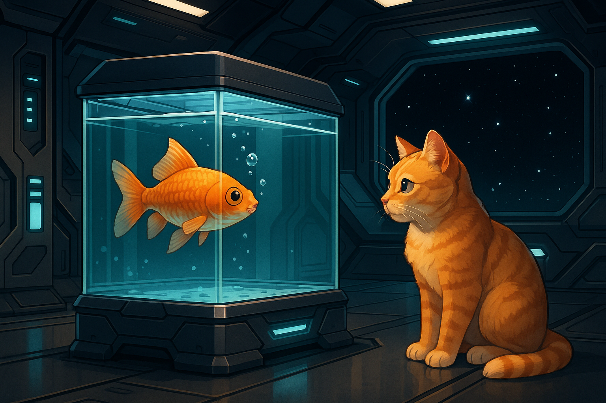

# Configuration



This repository contains terminal configurations optimized for development work, featuring Kitty terminal with theme switching, consistent color schemes, and fish shell integration.

## Installation

Follow these steps in order to set up your terminal environment:

### 1. Kitty Terminal

**Install Kitty**:

```bash
# The fast, feature-rich, GPU based terminal emulator
brew install --cask kitty
```

**Apply Kitty configuration**:

```bash
# Create symlink to entire folder to keep in sync
ln -sf "$(pwd)/kitty" ~/.config/kitty
```

### 2. Starship Prompt

**Install Starship**:

```bash
# The minimal, blazing-fast, and infinitely customizable prompt for any shell
brew install starship
```

**Apply Starship configuration**:

```bash
# Create symlink to config file to keep in sync
ln -sf "$(pwd)/starship/starship.toml" ~/.config/starship.toml
```

### 3. Zoxide

**Install Zoxide**:

```bash
# Zoxide is a smarter cd command, inspired by z and autojump.
brew install zoxide
```

### 4. Fish Shell

**Install Fish shell**:

```bash
# Fish is a smart and user-friendly command line shell.
brew install fish
```

**Apply Fish configuration**:

```bash
# Create symlink to entire folder to keep in sync
ln -sf "$(pwd)/fish" ~/.config/fish
```

### 5. Fisher Plugin Manager

**Install Fisher**:

```bash
# A plugin manager for Fish
curl -sL https://raw.githubusercontent.com/jorgebucaran/fisher/main/functions/fisher.fish | source && fisher install jorgebucaran/fisher
```

### 6. SDKMAN

**Install SDKMAN**:

```bash
# Reliable companion for effortlessly managing multiple Software Development Kits
curl -s "https://get.sdkman.io" | bash

# Makes command sdk
fisher install reitzig/sdkman-for-fish@v2.1.0
```

### 7. Clojure Configuration

**Install Clojure**:

```bash
# Clojure is a dynamic, general-purpose programming language
brew install clojure
```

**Apply Clojure configuration**:

```bash
# Create symlink to entire folder to keep in sync
ln -sf "$(pwd)/clojure" ~/.clojure
```

## Backup Existing Configuration

**Before applying new configurations, backup your existing setup**:

```bash
# Backup existing configurations (rename to .backup to preserve)

# Fish
mv ~/.config/fish ~/.config/fish.backup

# Kitty
mv ~/.config/kitty ~/.config/kitty.backup

# Starship
mv ~/.config/starship.toml ~/.config/starship.toml.backup

# Clojure
mv ~/.clojure ~/.clojure.backup

# Neovim (config, data, state, cache)
mv ~/.config/nvim ~/.config/nvim.backup
mv ~/.local/share/nvim ~/.local/share/nvim.backup
mv ~/.local/state/nvim ~/.local/state/nvim.backup
mv ~/.cache/nvim ~/.cache/nvim.backup
```

## References

- **Kitty Terminal**: [kovidgoyal/kitty](https://github.com/kovidgoyal/kitty)
- **Starship Prompt**: [starship/starship](https://github.com/starship/starship)
- **Zoxide**: [ajeetdsouza/zoxide](https://github.com/ajeetdsouza/zoxide)
- **Fish Shell**: [fish-shell/fish-shell](https://github.com/fish-shell/fish-shell)
- **Fisher Plugin Manager**: [jorgebucaran/fisher](https://github.com/jorgebucaran/fisher)
- **SDKMAN Repository**: [sdkman/sdkman-cli](https://github.com/sdkman/sdkman-cli)
- **Fish Integration**: [reitzig/sdkman-for-fish](https://github.com/reitzig/sdkman-for-fish)
- **Clojure Configuration**: [practicalli/clojure-cli-config](https://github.com/practicalli/clojure-cli-config)
