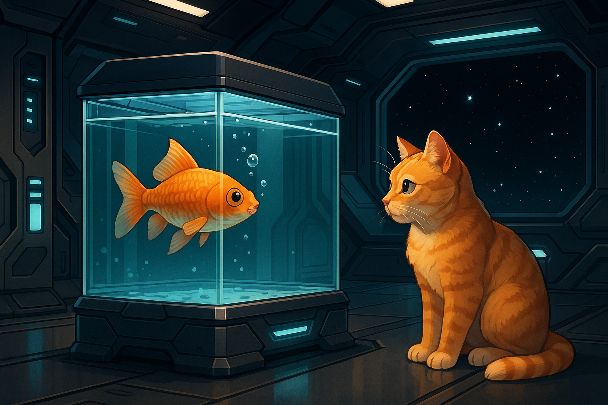

# Configuration



This repository contains terminal configurations optimized for development work, featuring Kitty terminal with theme switching, consistent color schemes, and fish shell integration.

## Installation

Follow these steps in order to set up your terminal environment:

### 1. Kitty Terminal

**Install Kitty**:

```bash
brew install --cask kitty
```

**Apply Kitty configuration**:

```bash
# Create symlink to entire folder to keep in sync
ln -sf "$(pwd)/kitty" ~/.config/kitty
```

### 2. Starship Prompt

**Install Starship**:

```bash
brew install starship
```

**Apply configuration**:

```bash
# Create symlink to entire folder to keep in sync
ln -sf "$(pwd)/starship/starship.toml" ~/.config/starship.toml
```

### 3. Fish Shell

**Install Fish shell**:

```bash
brew install fish
```

**Apply Fish configuration**:

```bash
# Create symlink to entire folder to keep in sync
ln -sf "$(pwd)/fish" ~/.config/fish
```

### 4. Fisher Plugin Manager

**Install Fisher**:

```bash
# Install fisher
curl -sL https://raw.githubusercontent.com/jorgebucaran/fisher/main/functions/fisher.fish | source && fisher install jorgebucaran/fisher
```

### 5. SDKMAN

**Install SDKMAN**:

```bash
# Install SDKMAN
curl -s "https://get.sdkman.io" | bash

# Makes command sdk 
fisher install reitzig/sdkman-for-fish@v2.1.0
```

## Backup Existing Configuration

**Before applying new configurations, backup your existing setup**:

```bash
# Backup existing fish config
mv ~/.config/fish ~/.config/fish.backup
mv ~/.config/kitty ~/.config/kitty.backup
mv ~/.config/starship.toml ~/.config/starship
```

## References

- **Kitty Terminal**: [kovidgoyal/kitty](https://github.com/kovidgoyal/kitty)
- **Starship Prompt**: [starship/starship](https://github.com/starship/starship)
- **Fish Shell**: [fish-shell/fish-shell](https://github.com/fish-shell/fish-shell)
- **Fisher Plugin Manager**: [jorgebucaran/fisher](https://github.com/jorgebucaran/fisher)
- **SDKMAN Repository**: [sdkman/sdkman-cli](https://github.com/sdkman/sdkman-cli)
- **Fish Integration**: [reitzig/sdkman-for-fish](https://github.com/reitzig/sdkman-for-fish)
